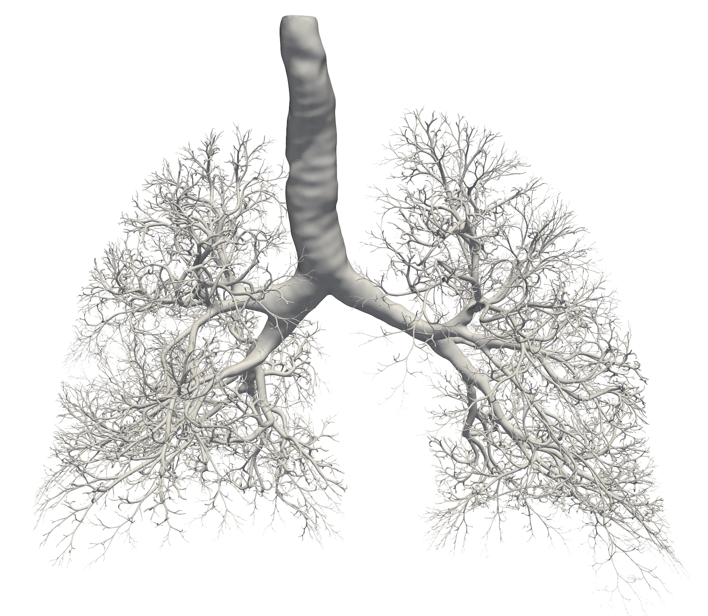
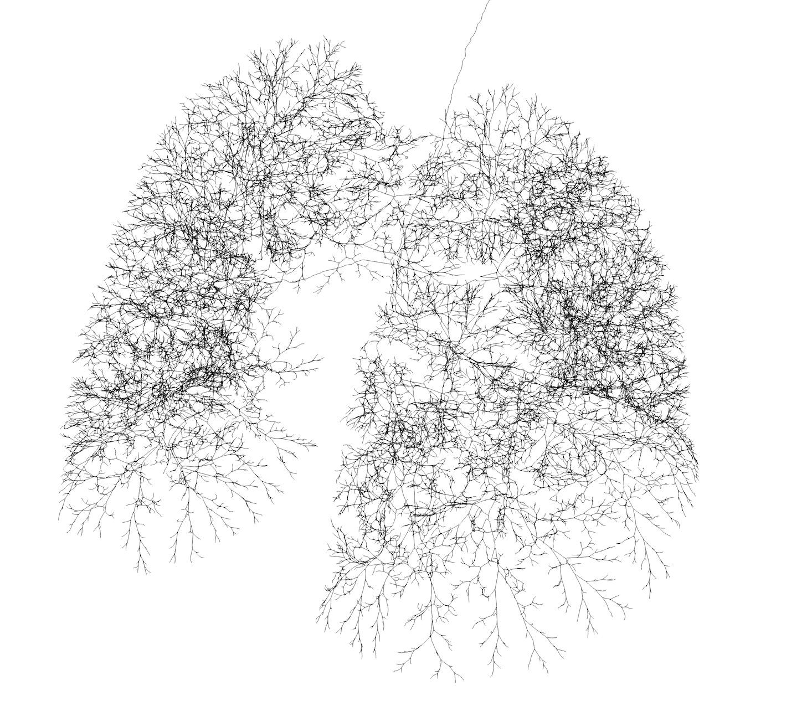
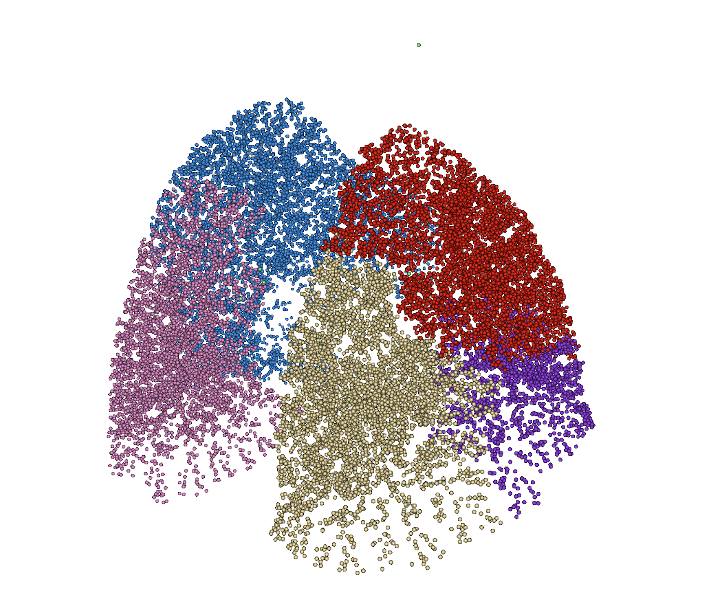
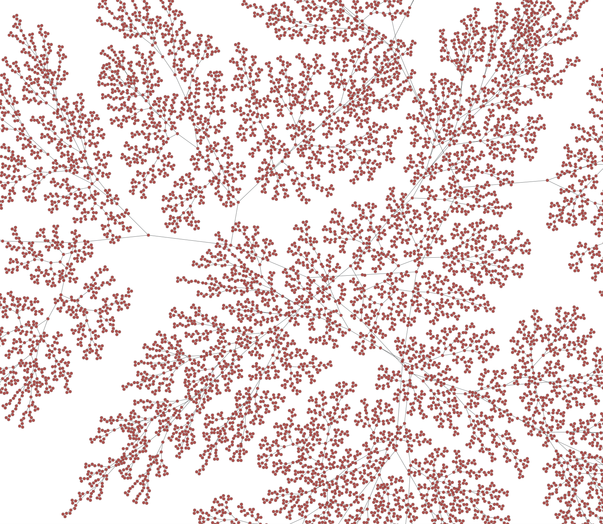

# bronch-skele
Python module to extract the skeleton from a bronchial tree mesh, as well as information regarding generation, lobe, intrabronchial distance matrix, and terminal information ready for the Bubble Model.

<figcaption>{{ include.description }}</figcaption>

## Input
- An *.stl* mesh representing a bronchial tree structure.
- A *.txt* file with the coordinates of the terminals of the mesh to keep.
- The position (x,y,z) of a point close to the trachea inlet.
- The positons (x,y,z) of at least one point close to the terminal of each lobe to keep. It might be necessary to give more than 1 terminal per lobe. This information is propagated upwards to lavel all nodes of the skeleton according to lobe.
- Optionally, to produce terminal data for BM, night the path to folders containing the *.stl* files of the secondary lung lobules and left and right lung.

## Output
- Two versions of the skeleton: smooth (passing inside the mesh, containing geometrical information) and simple (only containing bifurcations and terminals, only topological connectivity information). This is given in various formats: *.csv*, *.vtk*, *.graphml*.
- Distance matrix between terminals through the bronchial tree.
- Information of the terminals almost ready to input into the Bubble Model.

